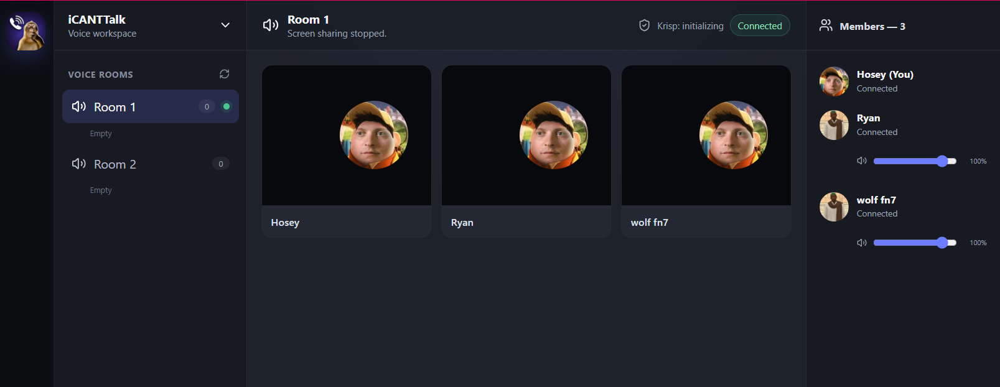

<p align="center">
  
</p>

<h1 align="center">iCANTtalk</h1>

<p align="center">
  Cross-platform LiveKit voice rooms for Windows and Android.
</p>

<p align="center">
  <strong>Voice · Webcam · Multi-stream screen sharing · Room presence · Local media controls</strong>
</p>

<p align="center">
  
  
  
  
</p>



## Overview

iCANTtalk is a focused Discord-style voice workspace built on LiveKit. It provides two permanent rooms—**Room 1** and **Room 2**—with compatible Windows and Android clients and a small Django service for issuing short-lived LiveKit tokens and room-presence previews.

The project deliberately excludes chat, file transfer, recording, friends, and account databases. User settings remain on the device, while LiveKit handles real-time media.

## Features

### Calling and media

- Two permanent cross-platform voice rooms
- Microphone mute, deafen, voice activity, and push-to-talk
- Input/output device and Android audio-route selection
- Webcam publishing with 480p, 720p, and 1080p quality options
- Windows monitor/window sharing and Android full-device sharing
- 480p, 720p, and 1080p screen sharing at 30 or 60 FPS
- Multiple remote webcams and screen shares visible at the same time
- Per-stream **Start Watching / Stop Watching** controls
- Fullscreen webcam and screen-share viewing
- Per-user voice volume controls
- Local mute and volume controls for incoming screen-share audio

### Audio processing

- WebRTC echo cancellation, noise suppression, and automatic gain control
- Optional Krisp enhanced noise filtering
- Standard WebRTC fallback when Krisp is unavailable

### Identity and lobby

- Locally saved editable display names
- 37 bundled profile pictures
- Random avatar assignment on first startup
- Cross-platform avatar metadata
- Room 1 and Room 2 participant previews before joining

### Security model

- LiveKit API secrets remain on the Django server
- Clients receive short-lived room-scoped participant tokens
- Shared application access key protects the Django endpoint
- Windows stores the access key with Electron `safeStorage`
- Android stores it with Android Keystore-backed AES-GCM encryption
- No call recording feature

## Repository structure

```text
.
├── windows/            Electron + React + TypeScript client
├── android/            Kotlin + Jetpack Compose client
├── server/django/      Token and room-presence endpoint
├── docs/               Architecture, deployment, build, and API guides
└── .github/            CI workflows and issue templates
```

## Quick start

### 1. Configure LiveKit and Django

Copy the Django app from `server/django/icanttalk_livekit` into your Django project, install its dependency, add the app to `INSTALLED_APPS`, and include its URLs.

Create server environment variables from:

```text
server/django/.env.example
```

Required values:

```env
LIVEKIT_URL=wss://your-project.livekit.cloud
LIVEKIT_API_KEY=your-livekit-api-key
LIVEKIT_API_SECRET=your-livekit-api-secret
ICANTTALK_ACCESS_KEY=your-separate-client-access-key
```

Never commit the real values.

### 2. Build Windows

Requirements:

- Windows 10 or 11 x64
- Node.js 22 or newer

```powershell
cd windows
.\BUILD_WINDOWS.ps1
```

Installer output:

```text
windows\release\iCANTTalk-Setup-1.1.1-x64.exe
```

Development mode:

```powershell
cd windows
npm install
npm run dev
```

### 3. Build Android

Requirements:

- JDK 17
- Android SDK Platform 36
- Android Build Tools

```powershell
cd android
$env:ANDROID_HOME = "$env:LOCALAPPDATA\Android\Sdk"
$env:ANDROID_SDK_ROOT = $env:ANDROID_HOME
.\BUILD_ANDROID.ps1
```

APK output:

```text
android\app\build\outputs\apk\debug\app-debug.apk
```

The debug APK is for testing. Configure Android release signing before public distribution.

## Client/server contract

Both clients send a token request to the Django endpoint:

```json
{
  "room_name": "Room 1",
  "participant_identity": "stable-installation-identity",
  "participant_name": "Alice",
  "avatar_id": "07",
  "platform": "windows"
}
```

The server returns:

```json
{
  "server_url": "wss://your-project.livekit.cloud",
  "participant_token": "eyJ..."
}
```

Room preview uses the same endpoint:

```json
{
  "action": "room_presence",
  "room_names": ["Room 1", "Room 2"],
  "client_version": "1.1.1"
}
```

See [docs/API.md](docs/API.md) for the complete contract.

## Documentation

- [Architecture](docs/ARCHITECTURE.md)
- [Build guide](docs/BUILDING.md)
- [Deployment guide](docs/DEPLOYMENT.md)
- [API contract](docs/API.md)
- [Troubleshooting](docs/TROUBLESHOOTING.md)
- [Privacy model](docs/PRIVACY.md)
- [GitHub publishing guide](GITHUB_SETUP.md)
- [Security policy](SECURITY.md)
- [Contributing](CONTRIBUTING.md)
- [Changelog](CHANGELOG.md)

## Current platform differences

- Windows can select monitors or application windows and can publish Windows loopback/system audio.
- Android shares the full device screen and does not publish internal application audio in this version.
- Push-to-talk works while the application receives the press; it is not a global system-wide hotkey.
- Manual application updates are used; no automatic updater is included.

## Project status

Version **1.1.1** is a functional development release. Before broad distribution, complete physical-device testing, configure HTTPS, sign the Windows installer, and sign the Android release APK/AAB.

## License

This repository is provided under the proprietary license in [LICENSE](LICENSE). No permission to copy, redistribute, publish, sublicense, or commercially use the code is granted unless the copyright owner gives written permission.
